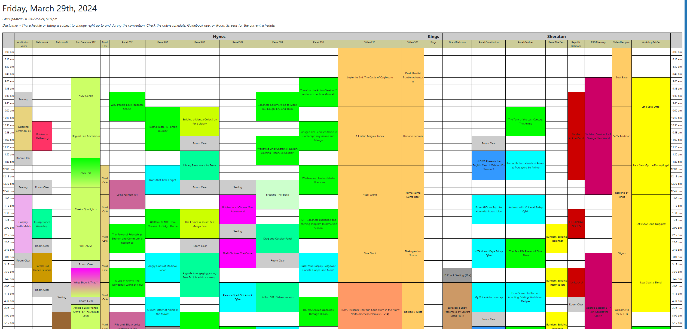
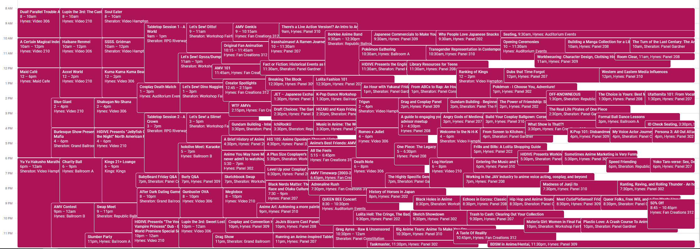
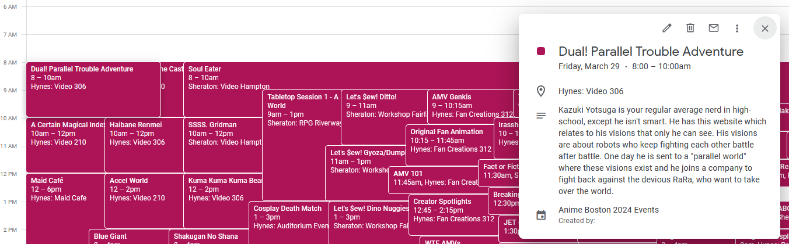

# Anime Boston Schedule-to-Calendar

This is a script that reads Anime Boston's (AB) [schedule page](https://www.animeboston.com/schedule/) and converts the HTML table (below) into an `.ical` file.

I found AB's page relatively unhelpful when it came to figuring out what I wanted to actually attend during the convention. This script allows you to import all of the events into a dedicated calendar app (e.g. Google Calendar) and edit them accordingly.

Once the events are imported into your calendar, you can delete events that you're not interested in attending.

This script also imports each event's description from their dedicated panel page, allowing for easy parsing of what the event is without needing to go to each page individually.

## Example usage

| Anime Boston schedule on their website |
| -------------------------------------- |
|  |

gets exported to an `.ical` file and [imported into Google Calendar](https://support.google.com/calendar/answer/37118?hl=en&co=GENIE.Platform%3DDesktop)...

| Google Calendar with Anime Boston events imported |
| ------------------------------------------------- |
|     |

after which you can then edit/delete events to your desire

---

event descriptions are also imported from their individual panel pages:

| Google Calendar event description from https://www.animeboston.com/schedule/video/1489 |
| -------------------------------------------------------------------------------------- |
|                                      |

## How to run

### Initial setup

- download and install [`Node v18+`](https://nodejs.org/en/download)
- download [pnpm](https://pnpm.io/installation)
- install dependencies with `pnpm install`

### Build

- start the watch server with `pnpm run watch`
  - alternatively just build the script once with `pnpm run build`
- run the script with `node ./dist/index.js`
